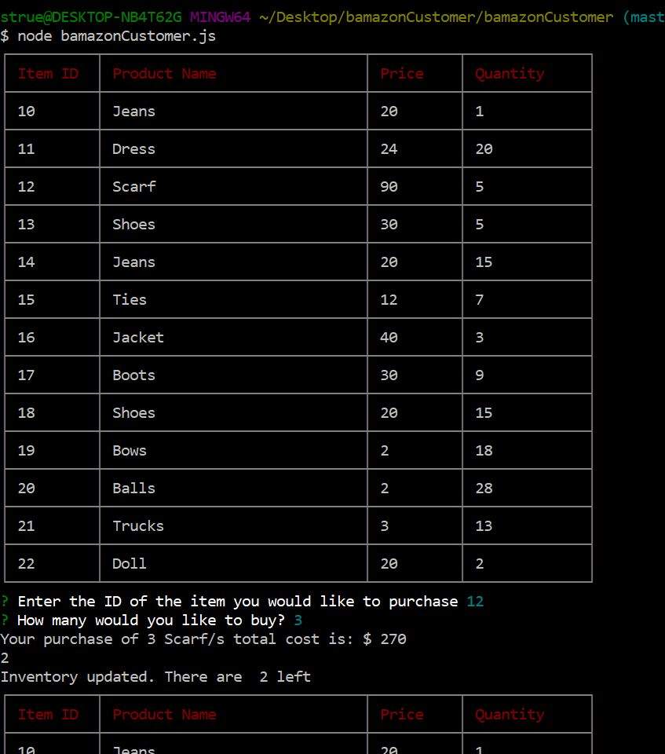

**OVERVIEW** 

A *Node.js* & *MySQL* command line Amazon-like storefront app that takes in a customers' order and depletes stock from the store Inventory. 

**INSTRUCTIONS**

The database is called 'bamazon_DB' with a  Table called 'products'. Schema is attached in the schema.js file.

Running the Node application called 'bamazonCustomer.js' application will first display all of the items available for sale. Include the ids, names, prices and quantities of products for sale.

Bamazon then prompts users with two messages: 
	* The first ask them the ID of the product they would like to buy. 
	* The second message should ask how many units of the product they would like to buy.

Once an order has been placed the application checks to see if the store has enough of the product to meet the user's request. *If not*, the app log the insufficient stock and recursively ask the item ID again.

However, if the store *does* have enough of the product, It will fulfill the user’s order showing the total price and quantity of the order as well as updating the SQL database to reflect the new quantity. 

**FUNCTIONALITY**  
[View video of working app here](https://drive.google.com/file/d/1kNMZyN8bVI9k4zuJZfquy2MBP_vk1Dwd/view)

